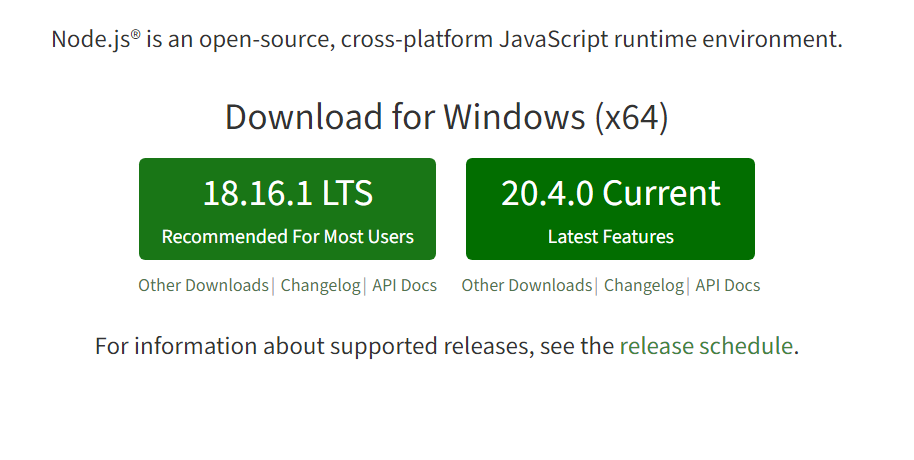
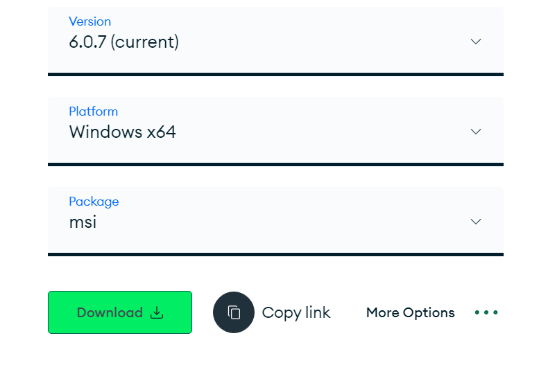
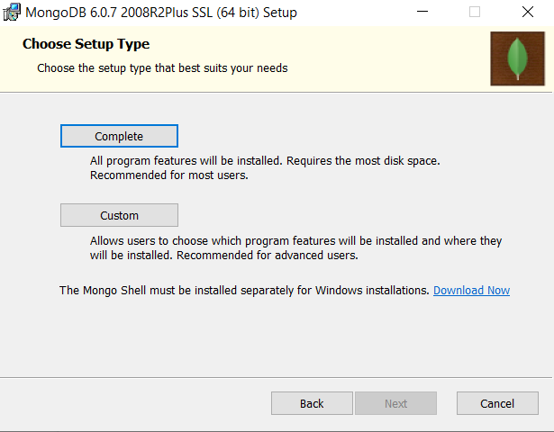
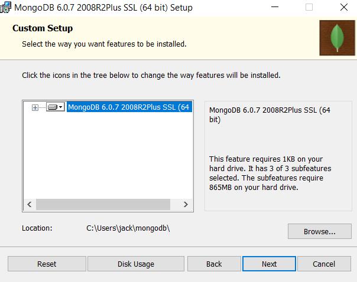
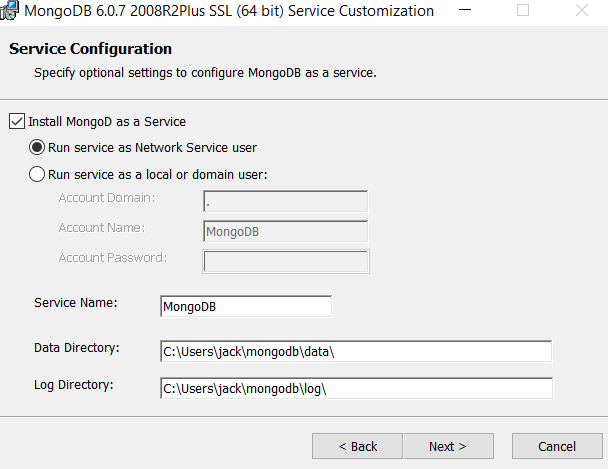
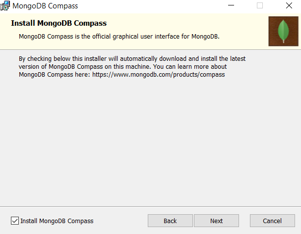
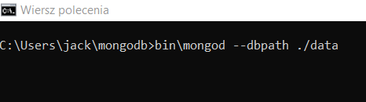
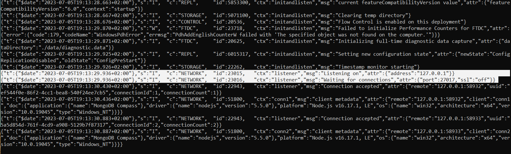
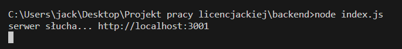
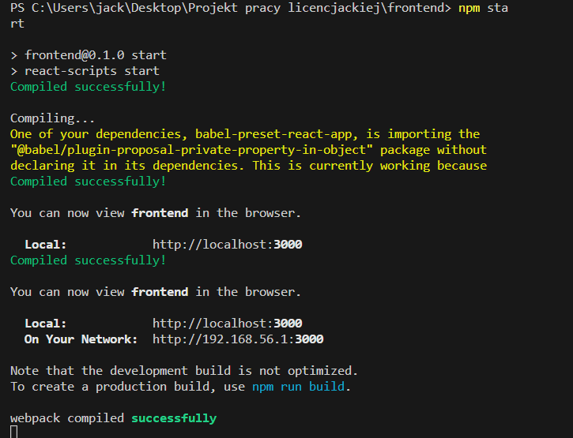

# Aplikacja Notatnika

Projekt aplikacji notatnika

## Instrukcja uruchomienia aplikacji
Jako, że aplikacja działa lokalnie należy:
1. Pobrać Node.js z głównej strony https://nodejs.org/en

    - następnie sprawdzić w środowisku czy jest zainstalowany komendą:
    ```bash
      node -v
    ```
    - następnie zainstalować NPM komendą:
    ```bash
      node i npm
    ``` 
    - sprawdzić czy jest zainstalowany:
    ```bash
      npm -v
    ```
    - zainstalować zależności w folderze **backend** jak i w folderze **frontend** komendą
    ```bash
      npm install
    ```

2. Pobrać MongoDB Community Server z tej strony: https://www.mongodb.com/try/download/community 

    
- następnie w instalatorze wybrać typ instalacji Custom


- następnie wybrać ścieżkę najlepiej jeśli to będzie na "Users/user" i stworzyć tam folder mongodb


- następnie ukaże się nam informacja o tym, że system zarejestruje nowy serwis o nazwie MongoDB za pomocą którego będziemy odpalać bazę danych. Jest tam także podany folder w którym będą przechowywane dane naszej bazy danych jest nim folder "data"

  

- na koniec opcjonalnie możemy zainstalować MongoDB Compass za pomocą którego będziemy mogli za pomocą interfejsu graficznego edytować naszą bazę danych

   

- podczas instalacji instalator oznajmi nas o zmianie ścieżki gdzie ma się znajdować nasz program bazodanowy, należy kliknąć **Ignore**
- po ukończonej instalacji wchodzimy w wiersz poleceń wchodzimy w folder z naszą bazą danych i wpisujemy poniższy kod

  

- informacja o udanym połączeniu z MongoDB z czego domyślny port oraz adres localhost przedstawia poniższy screen

- ważne jest aby nie wyłączać terminala gdy korzystamy z aplikacji
3. Aby aplikacja poprawnie działa trzeba również włączyć serwer node.js w konsoli CMD najlepiej w środowisku Visual Studio Code

4. Trzeba również odpalić React Development Server w PowerShell'u 

5. Gdy wszystko poprawnie uruchomimy powinna odpalić się nam aplikacja pod adresem http://localhost:3000/